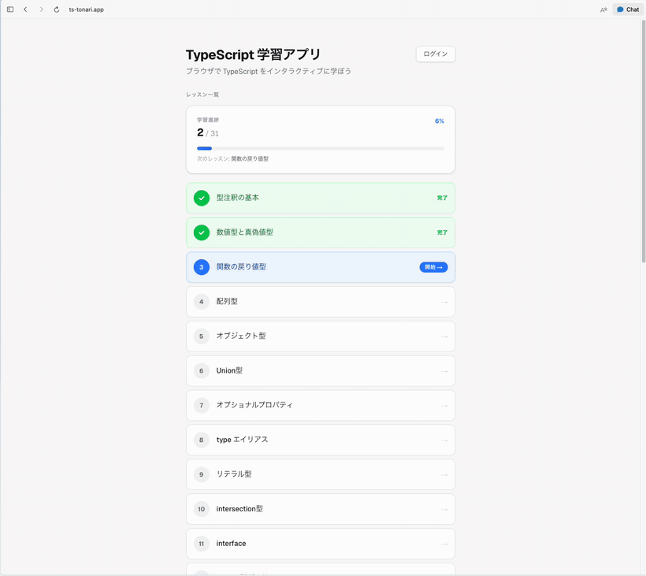

# ts-tonari — 日本語で学ぶインタラクティブ TypeScript 学習アプリ

[](https://ts-tonari.app)
[](https://nextjs.org)
[](https://www.typescriptlang.org/)
[](./LICENSE)

ブラウザ上で TypeScript コードを書き、**その場で型チェックと自動採点**を受けながら学べる学習 Web アプリです。「**日本語 × インタラクティブ × 無料**」の組み合わせで、初級〜中級の **31 レッスン**を公開・運用しています。

🔗 **ライブデモ: https://ts-tonari.app** （最初の 3 レッスンはログイン不要で試せます）

## デモ



> 型エラーの検出 → 型注釈の追加 → 自動採点（正解判定）までの一連の流れ。実際に触れるライブ版 → **https://ts-tonari.app**

## English summary

**ts-tonari** (https://ts-tonari.app) is an interactive TypeScript learning web app for Japanese speakers. You write TypeScript in an in-browser Monaco editor and get instant type diagnostics (localized into Japanese) and automated grading — no local setup required. **31 original lessons** (beginner to intermediate) are live in production, and the first 3 lessons work without signing in.

- **100% client-side code execution** — user code runs isolated in a Web Worker (5s timeout + `terminate()`), never on the server
- **Hardened grading engine** — a lexical scanner strips comments/string literals before type-syntax checks, blocking "keyword-in-a-comment" cheating
- **Auth & progress tracking** — GitHub / Google OAuth via Supabase (Postgres + Row Level Security)
- **Security** — enforced CSP, security headers, open-redirect protection, self-hosted Monaco (no CDN dependency)
- **Stack** — Next.js 16 (App Router) · React 19 · TypeScript strict · Tailwind CSS · Supabase · Vercel (custom domain)

## 主な機能

- **ブラウザ内エディタ**（Monaco）でコードを書き、リアルタイムに型診断（エラーメッセージを日本語化）
- **自動採点**：型チェック・実行値・型構文の 3 観点で「答え合わせ」
- **認証と進捗保存**：GitHub / Google OAuth でログイン、レッスン進捗を保存（未ログインのゲスト試用も可）
- **オリジナル日本語カリキュラム**：初級 15 ＋ 中級 16 ＝ 31 レッスン（型注釈 → ジェネリクス → keyof・ユーティリティ型 → Promise/async）

## 技術スタック

| 領域 | 採用技術 |
| --- | --- |
| フレームワーク | Next.js 16（App Router / Turbopack）・React 19・TypeScript strict |
| エディタ | Monaco Editor（セルフホスト） |
| スタイリング | Tailwind CSS |
| バックエンド | Supabase（Auth / Postgres / Row Level Security） |
| ホスティング | Vercel（独自ドメイン ts-tonari.app） |

## 技術ハイライト（設計上の見どころ）

- **100% クライアントサイドのコード実行・採点**：ユーザーの TypeScript は **Web Worker 内で隔離実行**（5 秒タイムアウト＋`terminate()`、サーバではユーザーコードを実行しない設計）。非同期レッスンは `AsyncFunction` でトップレベル `await` に対応。
- **採点ロジックの堅牢化**：型構文チェックを **字句スキャナでサニタイズ**（コメント・文字列リテラルを除去）し、「キーワードをコメントに書くだけのチート合格」を封鎖。Monaco を **strict 化**し、型を書かないと採点に進めない型ゲートを実装。
- **セキュリティ**：CSP 強制適用 / Supabase RLS / オープンリダイレクト対策 / セキュリティヘッダ / Monaco セルフホストによる CDN（jsdelivr）依存の解消。
- **検証文化**：レッスン判定の**ヘッドレス回帰テスト**（`scripts/verify-lessons.cjs` / `verify-strict.cjs`）＋ブラウザ実機検証。「テストが緑＝健全とは限らない」を前提にした検証設計。

## 設計・意思決定ドキュメント

開発の設計判断は `.company/engineering/docs/` に記録しています。

- [アーキテクチャ](.company/engineering/docs/architecture.md)
- [データベース設計](.company/engineering/docs/database-design.md)
- [セキュリティ設計](.company/engineering/docs/security.md)
- [判定エンジンの偽陽性脆弱性の発見と修正](.company/engineering/docs/2026-06-09-judge-false-positive.md)
- [中級カリキュラム設計](.company/engineering/docs/curriculum-intermediate.md)
- [技術選定](.company/engineering/docs/tech-stack.md)

## ローカル実行

```bash
cd typescript-learning-app
npm install        # postinstall で Monaco アセットを public/ へ配置
npm run dev        # http://localhost:3000
```

- 最初の 3 レッスンはログイン不要で動作確認できます。
- 認証・進捗保存まで試す場合はローカル Supabase が必要です（`supabase start`）。未起動でも初回ページ表示時に認証リトライで待ちが入るだけで、レッスン自体は動作します。

### レッスン判定の検証

```bash
cd typescript-learning-app
node scripts/verify-lessons.cjs   # 模範解答=正解 / 誤答(コメント偽装含む)=不正解 の回帰
node scripts/verify-strict.cjs    # 模範解答が strict でクリーンかを検証
```

## リポジトリ構成

```
.
├── typescript-learning-app/   # アプリ本体（Next.js）
└── .company/engineering/docs/ # 設計・意思決定ドキュメント
```

## ライセンス

[MIT](./LICENSE)
